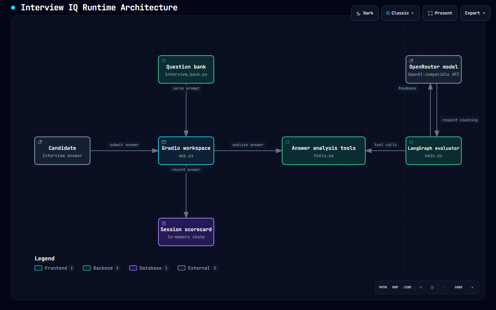

# Interview IQ

> An AI-assisted mock interview coach that turns every answer into a measurable improvement loop.

[](https://www.python.org/)
[](https://www.gradio.app/)
[](https://langchain-ai.github.io/langgraph/)

[Link](https://www.loom.com/share/e73216029b8342349d0e8fc7174ad01f)

Interview IQ is a focused practice environment for software-engineering interviews. It combines a guided question bank, an interactive Gradio scorecard, deterministic communication checks, STAR-structure analysis, and an OpenRouter-backed evaluator agent.

The project is designed around a practical hiring signal: can a candidate explain decisions clearly, reason about trade-offs, and improve from feedback?

## Why This Project

Interview preparation often produces too little feedback and too much passive content. Interview IQ makes practice observable:

- **Practice** with behavioral, system-design, teamwork, and problem-solving prompts.
- **Inspect** filler words, repetition, sentence length, pauses, STAR coverage, and keyword relevance.
- **Reflect** through a live scorecard and an end-of-session report.
- **Extend** the evaluator through LangGraph tools instead of hiding the logic inside one prompt.

## Product Flow

The current Gradio flow uses mock feedback while the LangGraph evaluator is available as a separate end-to-end experiment. The architecture boundary is intentional: deterministic checks remain inspectable, while model-based coaching can evolve independently.

[](docs/interview-iq.architecture.html)

Open the preview image to explore the [interactive Archify scenario](docs/interview-iq.architecture.html) in its black theme. The [architecture notes](docs/architecture.md) document the component decisions and current limitations.

## Highlights

| Capability | What it demonstrates |
| --- | --- |
| Guided mock interview UI | State management, event-driven Gradio callbacks, and candidate workflow design |
| Live scorecard | Structured session data instead of unbounded chat output |
| STAR analysis | Explainable heuristic evaluation for behavioral interviews |
| Communication analysis | Small, composable tools for practical answer quality signals |
| Tool-using evaluator | LangGraph state, conditional tool routing, and OpenAI-compatible model access |
| Secret-safe configuration | Environment-based API keys with `.env` excluded from Git |

## Quick Start

### 1. Create an environment

```powershell
python -m venv .venv
.\.venv\Scripts\Activate.ps1
pip install -r requirements.txt
```

### 2. Configure the model agent

Create a local `.env` file only when running the model-backed evaluator:

```env
Open_API_KEY=your_openrouter_key
```

The key is read locally through `python-dotenv` and is intentionally ignored by Git. Never commit credentials or paste them into issues, screenshots, or README files.

### 3. Launch the interview workspace

```powershell
python app.py
```

Open the local Gradio URL printed in the terminal. The app currently supports submitting answers, viewing a live scorecard, asking a meta-question, and generating a mock final report.

### 4. Run the evaluator experiment

```powershell
python main.py
```

This runs a single LangGraph evaluation against the configured OpenRouter-compatible model and prints the resulting feedback.

## Repository Structure

The repository follows an Archify-inspired documentation pattern: the README explains the product contract, `docs/` holds the system map, and each Python module has one clear responsibility.

```text
Interview_IQ/
|-- app.py                 # Gradio product surface and session callbacks
|-- main.py                # LangGraph evaluator and tool-routing experiment
|-- interview_bank.py      # Curated prompts and expected answer signals
|-- tools.py               # Explainable answer-analysis tools
|-- model_config.py        # OpenAI-compatible model smoke test
|-- requirements.txt       # Runtime dependencies
|-- docs/
|   `-- architecture.md    # Component map, data flow, and design decisions
|-- .env                   # Local-only configuration; never committed
`-- README.md
```

## Engineering Notes

- **Explainability first:** deterministic checks return structured dictionaries with the signal, matched data, and flags.
- **Separation of concerns:** the UI, question bank, analysis tools, and model orchestration are separate modules.
- **Provider flexibility:** the evaluator uses the OpenAI-compatible API surface exposed by OpenRouter.
- **Honest product scope:** this is an actively evolving prototype; model feedback is not yet wired into the main Gradio submission callback.

## Project Status

Interview IQ is a working prototype and a foundation for a production-quality coaching loop. The highest-value next increments are:

1. Connect the LangGraph evaluator to the Gradio submission flow.
2. Replace global session state with per-user `gr.State` or a session store.
3. Add automated tests for each analysis tool and the interview state transitions.
4. Replace keyword-only relevance with rubric-based scoring and calibrated examples.
5. Add answer history export and targeted practice by role and company interview type.

## Contributing

Small, focused improvements are welcome. Before opening a pull request, keep changes scoped, add tests for new scoring behavior, and confirm that no secrets or generated Gradio state are included.

