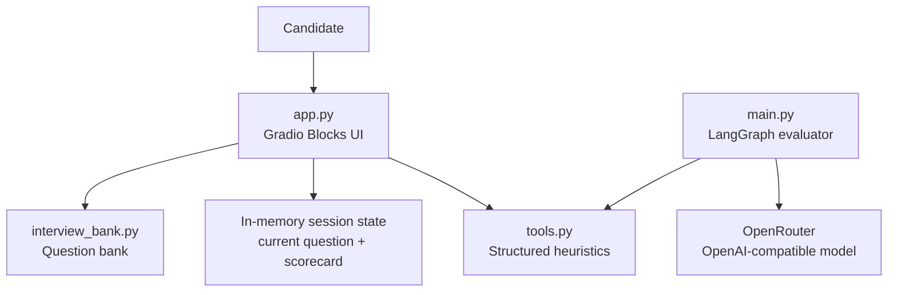

# Interview IQ Architecture

This map follows the evidence-led style of [Archify](https://github.com/tt-a1i/archify): components, responsibilities, and runtime paths are documented from the repository rather than inferred as production behavior.

## Current Runtime Map

## Responsibility Boundaries

| Component | Responsibility | Current state |
| --- | --- | --- |
| `app.py` | Presents the interview workspace and handles answer submission | Main user-facing entry point |
| `interview_bank.py` | Owns prompts, categories, and expected keywords | Static, easy to extend |
| `tools.py` | Runs explainable answer-quality checks | Deterministic and independently testable |
| `main.py` | Builds the LangGraph evaluator and routes tool calls | Standalone integration experiment |
| `model_config.py` | Verifies direct model-provider connectivity | Developer smoke test |

## Primary Paths

### Interactive practice

1. The candidate opens the Gradio workspace.
2. `app.py` presents the current prompt from the interview bank.
3. A submission records the answer in the in-memory scorecard.
4. The UI advances to the next prompt and exposes feedback.

### Model-backed evaluation

1. `main.py` creates a LangGraph state containing the evaluation request.
2. The evaluator node calls the OpenRouter-compatible chat model with bound tools.
3. LangGraph routes tool calls to `tools.py` and returns their results to the evaluator.
4. The final message is printed as coaching feedback.

## Deliberate Gaps

The map distinguishes implemented paths from planned product integration:

- The Gradio callback currently returns mock feedback and does not invoke `main.py`.
- Session state is process-global, so concurrent users would share state.
- There is no persistence layer or authentication.
- The scoring tools are heuristics, not a validated hiring assessment.

These are explicit roadmap items, not hidden assumptions. That makes the next engineering decisions measurable and reviewable.